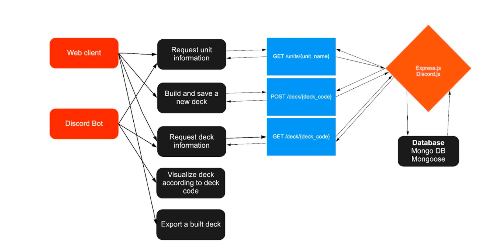

INFO 441 Server-side Development

Group 3: Leon Kan, Yudong Li, Zhewen Zheng, Wenyi Sun

Final Project Proposal
# An assistant application for steel division 2
### Project Description
  Gamer A is a player of Steel Division 2. Steel Division 2 is a WW2 themed
  real time strategy game where players are able to build their own battle groups
  from historical divisions from various countries and compete with others during
  online matches. After playing the game for a while he found that the game did
   a terrible job at visualizing the unit statistics. For example, the displayed
   fire rate of all the small arms in-game only represents the ammo consumption
   speed instead of the actual fire rate. Some weapons in game such as mortars
   and anti-aircraft guns fire their rounds in bursts with a short delay in
   between each shot and a longer delay between bursts. However, the game only
   displays the average rate of fire within a minute. Armor-piercing shells
   have penetration drop off according to distance, but there is no way to
   see the actual drop off rate and distance in game. Unless gamer A datamine
   the game files, he has no way to access these data. So he is very frustrated.

  Gamer B thinks the deck-building component and the variety of units in the
  game are intriguing. When having some fragmented spare time such as when
  riding a bus or waiting for food at the restaurant, he wants to learn more
  about different units and divisions. However, there are no ways for him to
  see these things unless he carries his pc on his back. He is also mildly
  infuriated because of this.  

  So as developers, we want to develop an assistive application for this game
  to address this problem. We will build a database that stores all the unit
  data and an api that is able to retrieve deck and unit information from the
  database. Users are able to use a web application to build their own decks
  when the pc is not around. And when the users want to get more detailed unit
   information, they can use a discord bot to retrieve the information.

### Technical Description
#### Architectural diagram mapping:

#### Flow of Data:

### Summary table of user stories

| Priority | User | Description | Technical Implementation |
|-------------|----| -----------|------------------------|
|P0|Player of Steel Division 2 / People who are interested in the game|I want to check the statistics and hidden attributes of a specific unit| User requests a unit’s information from the server through the unit’s name. And the server will request from the database and send back to the client a list of units whose name contains the user input.|
|P1|Player of Steel Division 2 / People who are interested in the game|I want to build a new deck|When requesting to build a new deck, the server will return the set up of the division that the user wants to build upon and the units that the division contains.|
|P2|Player of Steel Division 2 / People who are interested in the game|I want to look up some deck information|The server will return a list of division that contains whose name contains the user input|

###  List of available endpoints
  - GET /units/{unit_name}
  - POST /deck/{deck_code}
  - GET /deck/{deck_code}

###  Database schemas
  - Units Schemas
  - Ammunition Schemas
  - Weapon Schemas
